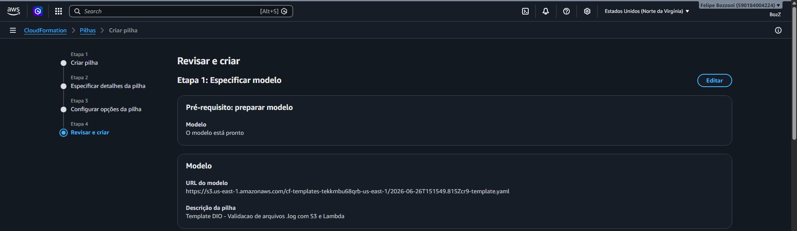
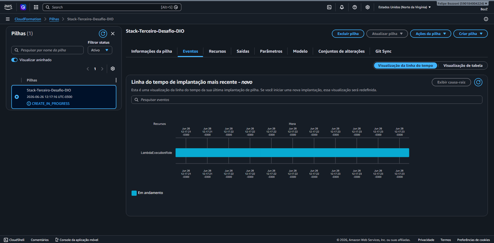
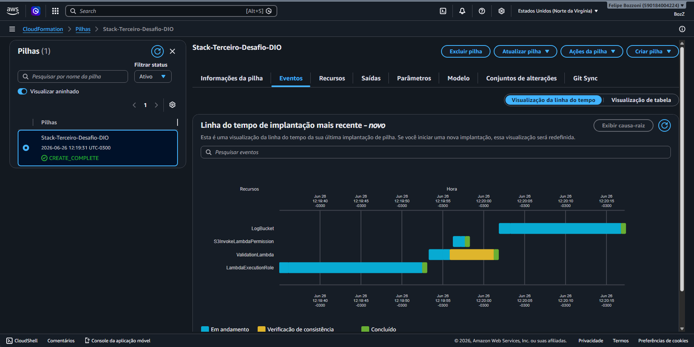
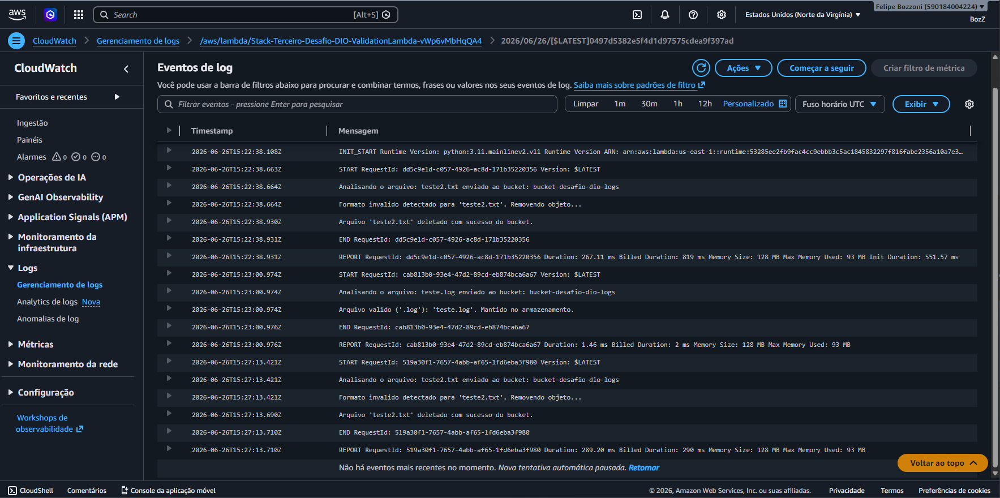
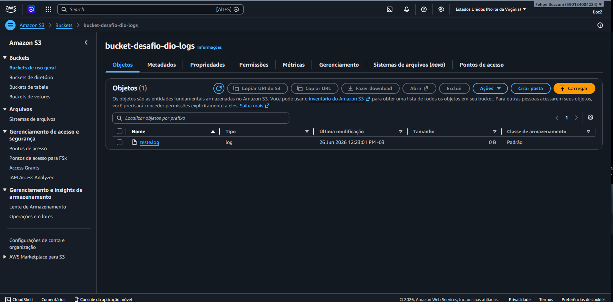

# Automação de Infraestrutura AWS: Validação de Logs com CloudFormation, S3 e Lambda

Desafio de projeto desenvolvido como parte do bootcamp da [DIO (Digital Innovation One)](https://www.dio.me/). O objetivo principal deste laboratório é consolidar conhecimentos em tarefas automatizadas e infraestrutura como código (IaC) no ambiente AWS.

---

## 📋 Descrição do Projeto

Este projeto consiste na criação automatizada de uma arquitetura *serverless* utilizando o **AWS CloudFormation**. A infraestrutura implementa uma pipeline reativa de segurança e organização de dados:
1. Um usuário realiza o upload de um arquivo qualquer em um bucket do **Amazon S3**.
2. O S3 dispara um evento automático para o **AWS Lambda**.
3. A função Lambda (desenvolvida em Python) analisa a extensão do arquivo enviado. 
4. Se o formato do arquivo **não** for `.log`, a Lambda o remove do bucket imediatamente. Arquivos `.log` válidos são mantidos com sucesso.

---

## 🛠️ Tecnologias e Serviços Utilizados

* **AWS CloudFormation:** Para automação e provisionamento da infraestrutura como código (IaC).
* **Amazon S3:** Para o armazenamento dos arquivos de logs.
* **AWS Lambda:** Para o processamento serverless da regra de negócio (validação de extensão).
* **Amazon CloudWatch:** Para monitoramento, retenção e auditoria dos logs de execução da Lambda.
* **Python 3.11:** Linguagem utilizada para o desenvolvimento do script de validação na Lambda.

---

## 📸 Imagens passo a passo do desenvolvimento do Bucket com o Lambda











---

## 📄 Código do Template (CloudFormation)

```yaml
AWSTemplateFormatVersion: '2010-09-09'
Description: 'Template DIO - Validacao de arquivos .log com S3 e Lambda'

Parameters:
  NomeDoBucket:
    Type: String
    Default: 'bucket-desafio-dio-logs'
    Description: 'Bucket Logs'

Resources:
  LambdaExecutionRole:
    Type: 'AWS::IAM::Role'
    Properties:
      AssumeRolePolicyDocument:
        Version: '2012-10-17'
        Statement:
          - Effect: Allow
            Principal:
              Service:
                - lambda.amazonaws.com
            Action:
              - 'sts:AssumeRole'
      Policies:
        - PolicyName: LambdaS3AndLogsPolicy
          PolicyDocument:
            Version: '2012-10-17'
            Statement:
              - Effect: Allow
                Action:
                  - 'logs:CreateLogGroup'
                  - 'logs:CreateLogStream'
                  - 'logs:PutLogEvents'
                Resource: 'arn:aws:logs:*:*:*'
              - Effect: Allow
                Action:
                  - 's3:GetObject'
                  - 's3:DeleteObject'
                Resource: !Join ['', ['arn:aws:s3:::', !Ref NomeDoBucket, '/*']]

  ValidationLambda:
    Type: 'AWS::Lambda::Function'
    Properties:
      Handler: index.handler
      Role: !GetAtt LambdaExecutionRole.Arn
      Runtime: python3.11
      Timeout: 30
      Code:
        ZipFile: |
          import boto3

          s3 = boto3.client('s3')

          def handler(event, context):
              for record in event['Records']:
                  bucket = record['s3']['bucket']['name']
                  key = record['s3']['object']['key']
                  
                  print(f"Analisando o arquivo: {key} enviado ao bucket: {bucket}")
                  
                  if not key.lower().endswith('.log'):
                      print(f"Formato invalido detectado para '{key}'. Removendo objeto...")
                      s3.delete_object(Bucket=bucket, Key=key)
                      print(f"Arquivo '{key}' deletado com sucesso do bucket.")
                  else:
                      print(f"Arquivo valido ('.log'): '{key}'. Mantido no armazenamento.")

  S3InvokeLambdaPermission:
    Type: 'AWS::Lambda::Permission'
    Properties:
      Action: 'lambda:InvokeFunction'
      FunctionName: !GetAtt ValidationLambda.Arn
      Principal: s3.amazonaws.com
      SourceArn: !Join ['', ['arn:aws:s3:::', !Ref NomeDoBucket]]

  LogBucket:
    Type: 'AWS::S3::Bucket'
    DependsOn: S3InvokeLambdaPermission
    Properties:
      BucketName: !Ref NomeDoBucket
      NotificationConfiguration:
        LambdaConfigurations:
          - Event: 's3:ObjectCreated:*'
            Function: !GetAtt ValidationLambda.Arn

Outputs:
  BucketCriado:
    Description: 'Bucket Logs'
    Value: !Ref LogBucket
  LambdaArn:
    Description: 'ARN da Lambda de Validacao'
    Value: !GetAtt ValidationLambda.Arn
